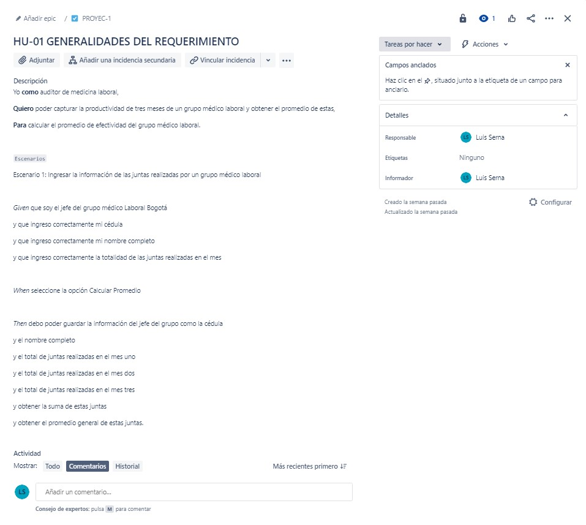

### CALCULO DEL PROMEDIO DE UN GRUPO MEDICO LABORAL ###
En la labor como programador de software he sido elegido para el desarrollo de una aplicación para el Área de Medicina Laboral que desea calcular el promedio de realización de las juntas médico laborales hechas por el grupo medico laboral Bogotá en el primer trimestre del año en curso. En esta área se audita la productividad en el ámbito nacional, verificando las metas, promedios y efectividad en cada trimestre, semestre y año. Como información básica de cada grupo, se debe registrar el número total de las juntas realizadas por mes, el nombre del jefe encargado y ciudad.

Aclaraciones:

* Se supondrá que la aplicación solo se requiere para calcular el promedio de realización de las juntas.

*No se realiza validación, ni se verifica calidad en los datos ingresados.

### ANALISIS DEL EJERCICIO ###
Yo **como** auditor de medicina laboral,

**Quiero** poder capturar la productividad de tres meses de un grupo médico laboral y obtener el promedio de estas,

**Para** calcular el promedio de efectividad del grupo médico laboral.

Escenarios

Escenario 1: Ingresar la información de las juntas realizadas por un grupo médico laboral

**Given** que soy el jefe del grupo médico Laboral Bogotá

y que ingreso correctamente la cédula del responsable

y que ingreso correctamente el nombre completo responsable

y que ingreso correctamente la totalidad de las juntas realizadas cada mes

**When** seleccione la opción Calcular Promedio

**Then** debo poder guardar la información del responsable del como la cédula 

y el nombre completo del responsable

y el total de juntas realizadas en el mes uno

y el total de juntas realizadas en el mes dos

y el total de juntas realizadas en el mes tres

### APROXIMACIÓN CASO DE USO ###

Descripción caso de uso
Nombre: Calcular Promedio de juntas realizadas
Actores: jefe grupo médico laboral
Propósito: Guardar identificación, nombre, grado y el numero total de las juntas realizadas por mes para calcular su promedio.
Curso Normal de Eventos:
1. El jefe del grupo médico ingresa la cantidad de salas.
2. El jefe del grupo médico ingresa la identificación, nombre, grado, el total del mes 1, el total del mes 2 y el total del mes de cada sala de juntas.
3. Se calcula el promedio a partir de:
( Σ(mes 1, mes 2, mes 3) / Total mes) / Cantidad juntas
4. Se Muestra el promedio de las juntas realizadas
Postcondiciones: Promedio de juntas Calculadas.

### APROXIMACIÓN DIAGRAMA DE FLUJO ###

### APROXIMACIÓN PSEUDOCÓDIGO ###

Inicio
Caracteres: identificaciones [50], nombres [50], grados [50]
Real: mesuno [50], mesdos [50], mestres [50]
Caracteres: identificacion, nombre, grado
Entero: numeroSalas, i
Real: mes1, mes2, mes3, promedio <- 0
Imprimir: ‘Digite el número de salas:’
Asignar: numeroSalas
Para i=0 hasta numeroSalas - 1, 1
Imprimir: ‘Digite la identificación del resposanble:’
Asignar: identificacion
Imprimir: ‘Digite el nombre del responsable:’
Asignar: nombre
Imprimir: ‘Digite el grado del responsable:’
Asignar: grado
Imprimir: ‘Digite las juntas realizadas en el mes 1:’
Asignar: mes1
Imprimir: ‘Digite las juntas realizadas en el mes 2:’
Asignar: mes2
Imprimir: ‘Digite las juntas realizadas en el mes 3:’
Asignar: mes3
identificaciones[i] <- identificacion
nombres [i] <- nombre
grado [i] <- grado
mesuno[i] <- mes1
mesdos[i] <- mes2
mestres[i] <- mes3
finPara
Para i=0 hasta numeroSalas -1, 1
promedio <-
promedio +((mesuno[i]+mesdos[i]+mestres[i])/3)numeroSalas
finPara
Imprimir: ‘El promedio de juntas realizadas es:’ + promedio
Fin